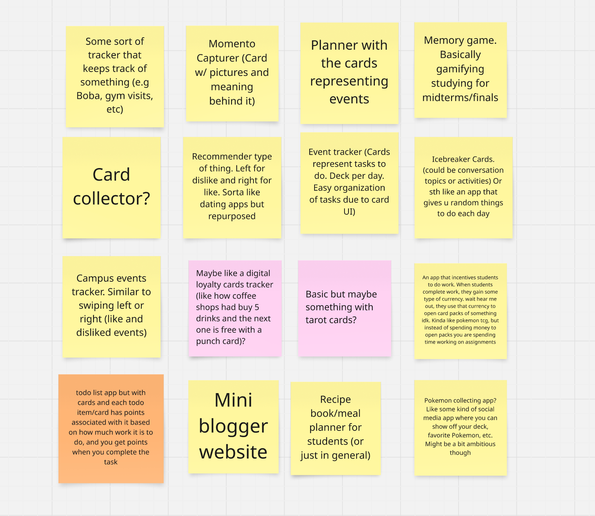
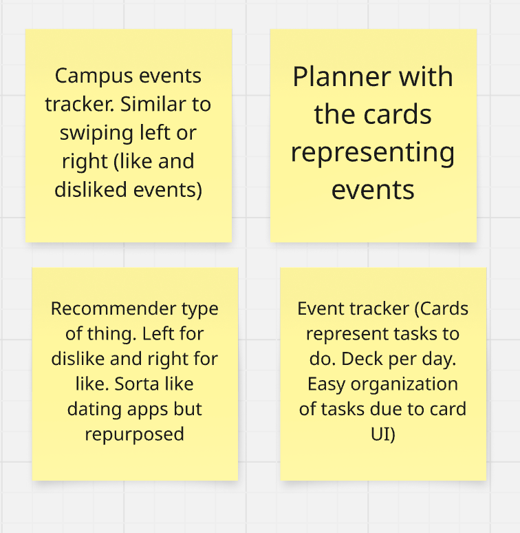
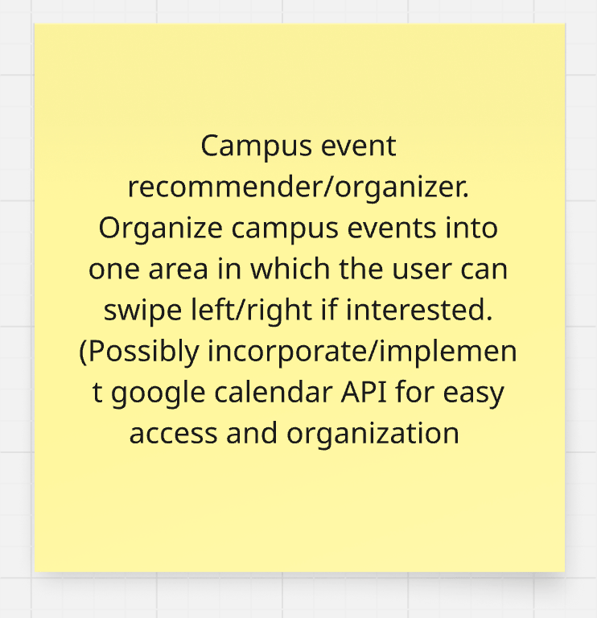

# Weekly Sunday Meeting

Throughout the week, we were brainstorming on Mira for potential card-related ideas to make them into an applications (we did this online on our own time and did not meet). In the meeting, we did the following:

## Attendance
The following people attended today's meeting:
- Charles Nguyen
- Aryan Ahuja 
- Alan De Luna
- Benjamin Miller
- Mia Chen
- Verania Salcido
- Wyatt Fong
- Lucas Hlaing
- Khang Nguyen
  
## Brainstorming Ideas

### First 12
We had a total of 12 ideas. We wanted to narrow it down with the following filters:

1. Remove any that are too difficult and can't be accomplished with the given timeframe
2. Anything that is considered too easy

Here is our Mira diagram:

   
We also grouped together different ideas if they are similar. After a group discussion, we went from 12 cards to 4

### Top 4 cards
1. Campus tracker events with a swiping feature (similar to tinder)
2. A planner with a card like feature in order to keep track of events
3. Some form of recommender, using a swipe gesture to showcase likes/dislikes
4. Event tracker that represents tasks to do which resets every day

You can see the final four we narrowed it down to:

### Making a choice
The top 4 that we chose we very similar. Based on what we chose, we decided to merge it all into one idea: an app that that organizes campus events in which a user can swipe left/right based on their interest on it. 

This was our final choice:

