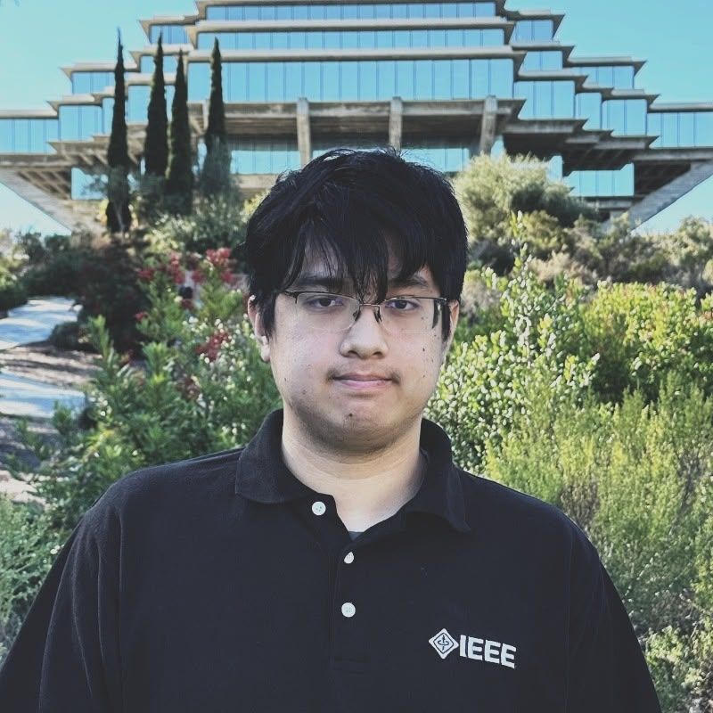
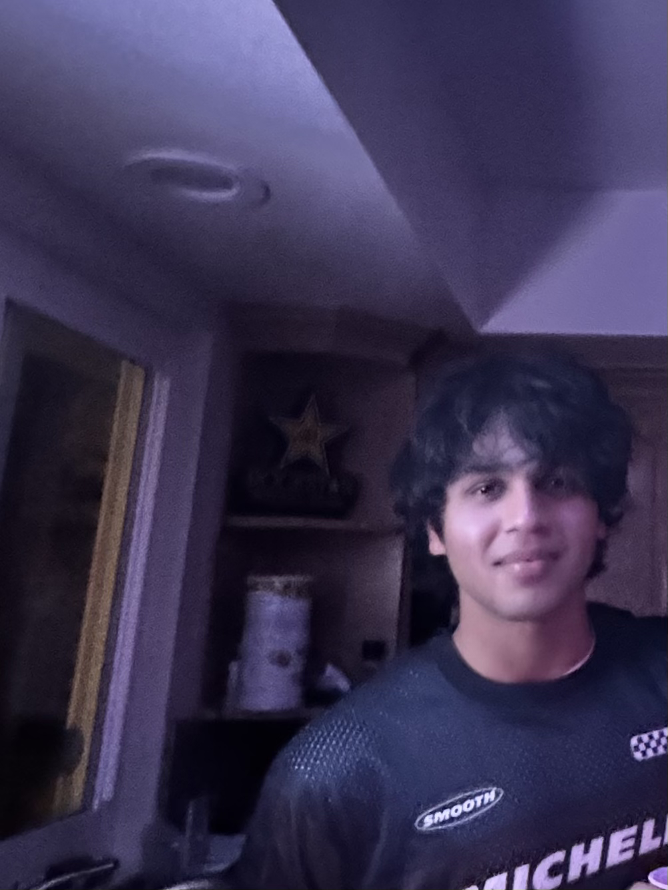
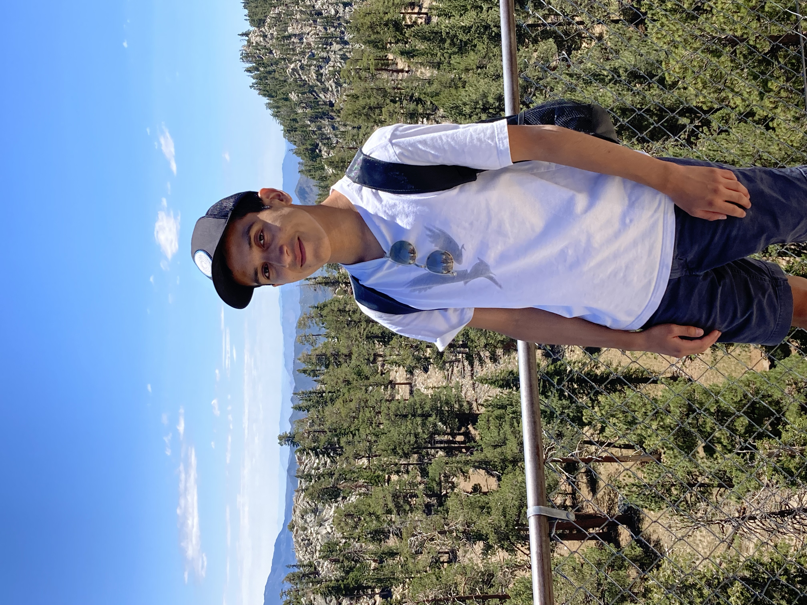

# The 11X developers

## Core Values

We, as a team, follow these core values:

### Collaboration

-   We ensure that the work gets distributed evenly
-   As a team, we make sure that we help each other when needed
-   We provide equal amounts of effort and contributions towards all of our projects

### Communication

-   As a team, we will communicate through slack
-   Our team leads make sure that the plan and meetings provide relevant and concise details
-   We make sure that information is shared and that everyone is aware and updated as to what is going on

### Respect

-   We want to make sure that people in out team are treated with respect
-   No member should be filling left out or isolated within our team
-   All criticisms are educational and not used as a way to attack a person's skills.

### Organization

-   ALl work that we do will remain in an organized manner
-   All projects will be stored in this organization
-   All text messages between members will be in the relevant slack channels and slack workspace.

## About our Team

### Team Leads

 

Hi everyone! My name is Charles Nguyen and I am a second year Computer Science major at UCSD.

I am a webmaster and Vice Chair Finance for IEEEUCSD and have experience in the following:

-   Docker
-   SSO (specifically OpenID Connect)
-   WebDev

You can visit my website by clicking [here](https://chark1es.dev)

 

Hey! I am a 2nd year Computer Science major from Sixth College. My github profile is [here](https://github.com/prashamshah115).

My hobbies are:

-   Working out, running, and hiking
-   Watching sports, especially formula 1 and tennis
-   Travelling and exploring places

### Team Developers

#### Sachin

 

Hello! I'm a second-year at UCSD majoring in Computer Science.

During my free time, I love to

-   Explore Sunny San Diego ☀
-   Travel to new places ✈️
-   Debug my life 👨‍💻

Fun fact: I love cooking fusion dishes that can offend multiple cultures at the same time 🥘👨‍🍳

[View my personal GitHub Page](https://github.com/Sachin-dot-py).

#### Wyatt

 

Hello! I'm a third-year at UCSD majoring in Computer Science. Some of my hobbies include:

-   Playing badminton 🏸
-   Undergoing big-back activities 🧋🍱

A fun fact about me is I recently travelled to Boston to compete in the annual National Collegiate Team Tournament representing UCSD

See my Github profile [here](https://github.com/wyatt-fong)

#### Lucas

 

Hii! I'm a second-year Computer Science major here at UCSD. Some hobbies of mine are:

-   cooking Asian dishes
-   playing the guitar (i suck)
-   playing video games with friends

Fun Fact: I've tried to learn Chinese 4 different times in my life meaning its been around 10 years, yet I still can't speak the language 😭

#### **Verania Salcido**

 
Hello! My name is Verania Salcido and I'm currently a 3rd year Computer Science major at Muir college!

A little bit about me:

-   I love getting sweet treats 🍬 🍭
-   I love doom scrolling on tiktok 📱🤳
-   See my Github profile [here](https://github.com/vesalcido)!

#### Khang

 

Hi! I'm a 2nd year UCSD student majoring in Computer Science and minoring in Cognitive Science.

Here is my [GitHub Page](https://github.com/khanggn)

When I have free time I like to:

-   Go to the gym or a run 🏃‍♂️
-   Binge Youtube or Netflix
-   Sleep
-   Eat

Fun Fact: I have a Pokemon card addiction and its not healthy.

#### Alan

 

Hello! I'm Alan and I am a third year computer science student at Muir college!

Aside from programming, some of my hobbies include:

-   Drawing (I hope to be a freelance artist on the side one day)
-   Listening to music (favorite band of all time is My Chemical Romance)
-   Playing video games (fun fact: I've been playing Smash Bros since I was 8)

Also check out my [Github](https://github.com/AlanDeLuna18) for other cool stuff I've done!

#### Mia

 
Hi! I am a 2nd year Computer Science major at UCSD, Sixth College. See my Github profile [here](https://github.com/miachen67).

In my free time, I enjoy:

-   Being outdoors - hiking, running, surfing 🏔️
-   Cooking/eating yummy food 🥘🍱

#### Benjamin

 
Hi! I am a 2nd year Computer Science major at UCSD, Muir College. See my Github profile [here](https://github.com/BenMiller0).

In my free time, I enjoy:

-   Scuba Diving💧
-   Going to theme parks🎢

#### Aryan

 

Hey! I'm a third year CS transfer student at Warren College! Feel free to check out my [GitHub Page](https://github.com/pycoder49)

Anyway, aside from rotting away all day in my room, here's a few things I LOVE doing:

1. Plyaing Badminton/Volleyball/PingPong (am I good in any of those though? No)
2. Making origami
3. Eeating out and trying new cafes!
4. Rotting in my room
5.

### Prasham
